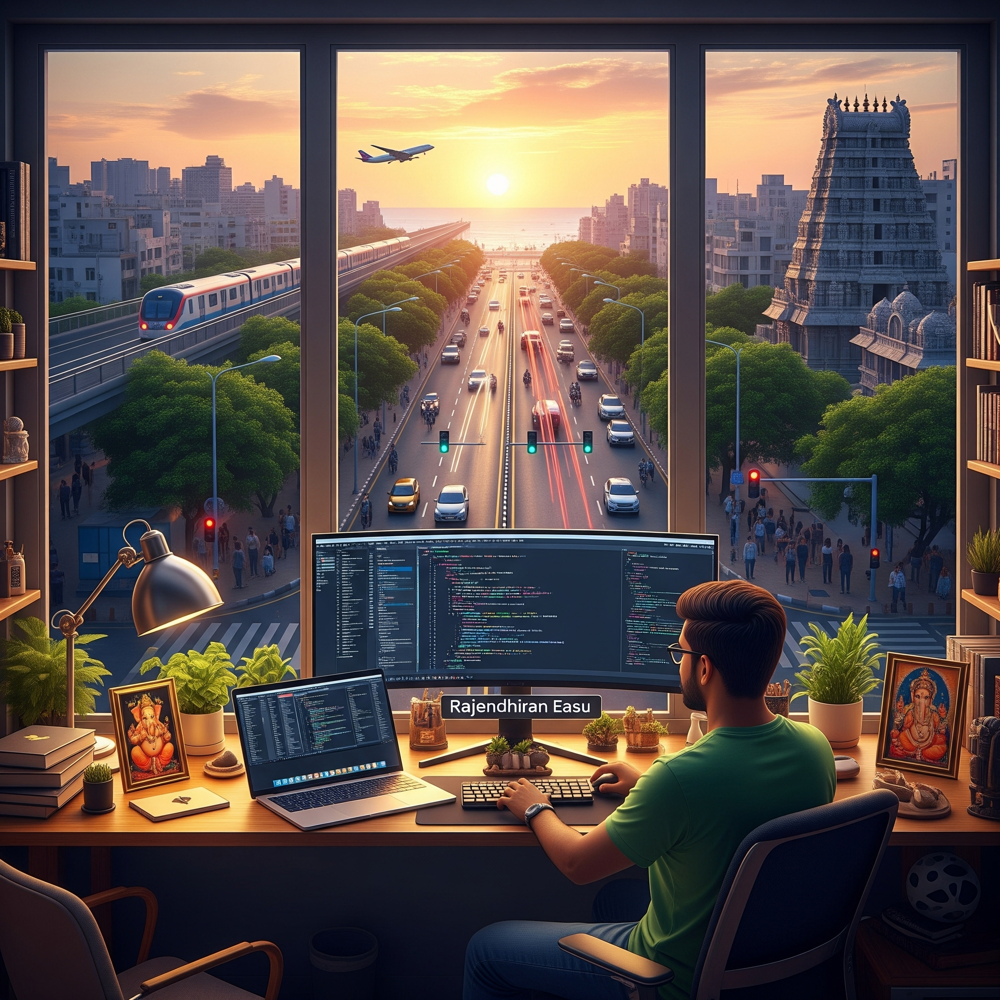

<h1> Hey, I’m Raj 👋 </h1>

 

<b><i>"Always our work speaks loud enough, doesn't need bodyguards."</i></b>

I am an easy going individual who thrives on taking on varied and challenging roles. I am confident working with
technical specialists across different domains on both products and service line. I have good hands-on experience in
building native mobile apps, focusing on Android Platform.  

## Tech. Stack

  
  
  
  
  
  
  
  
  
 
	 
  
	
  
  
  
  
  
  

## Github Stats

&nbsp;&nbsp;&nbsp;

## Feel free to connect with me here

